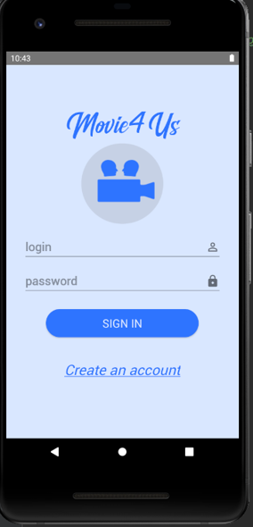
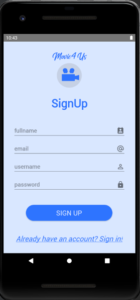
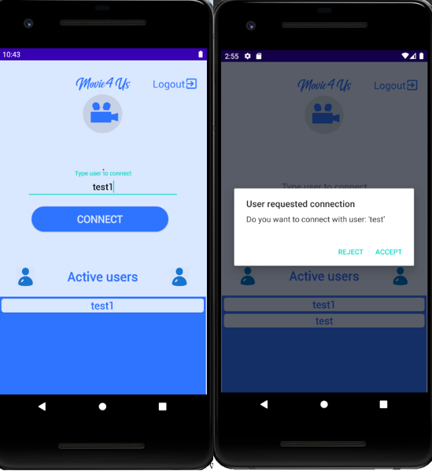
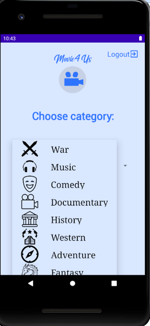
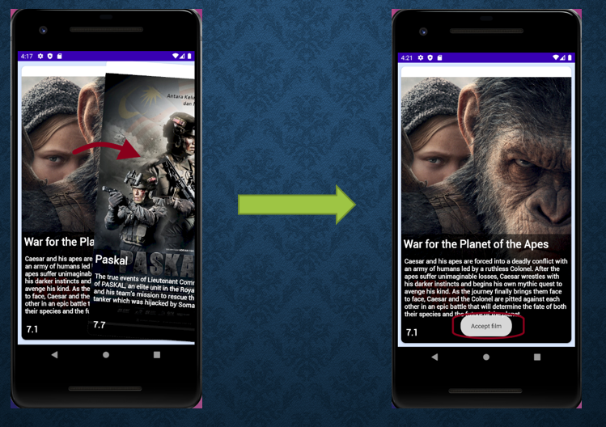
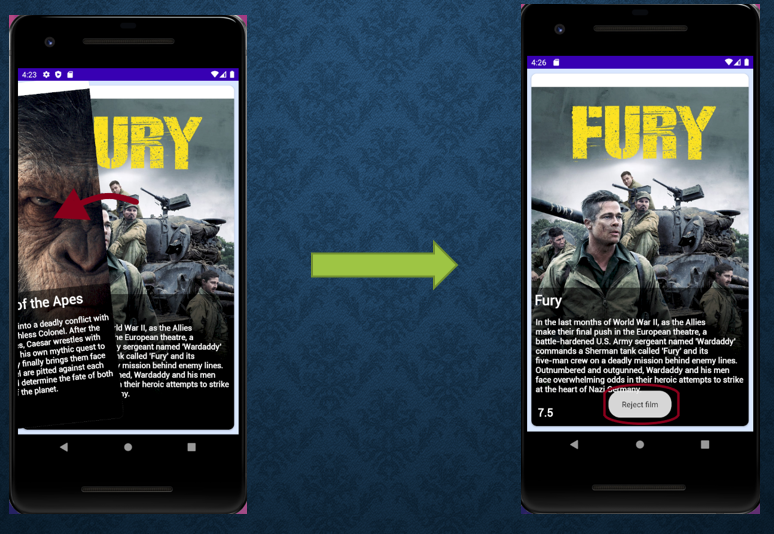
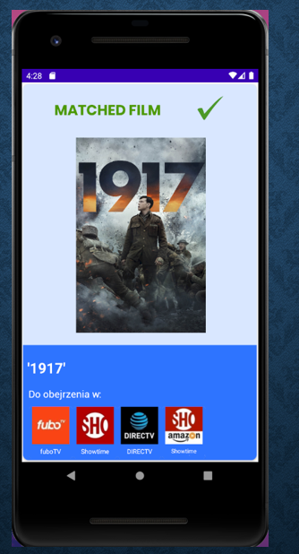

# Movie4Us

App for choosing a movie.

## Demo 
[Link to a usage example](https://www.youtube.com/watch?v=tH0CrgiaG9c)
## Login/Register

## Connection to second user

## Selecting a movie category

## Accept the movie

## Rejection of the film

## Matching the movie to both users 
